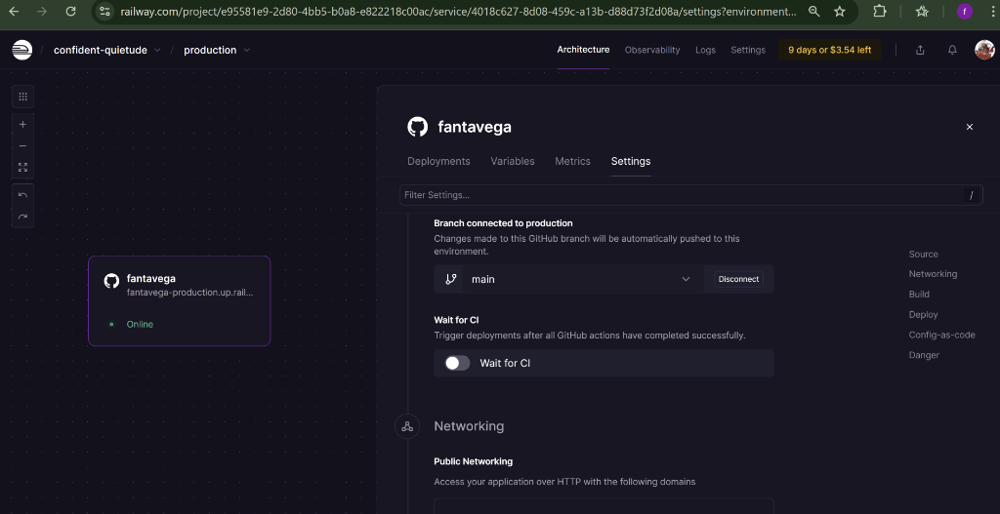
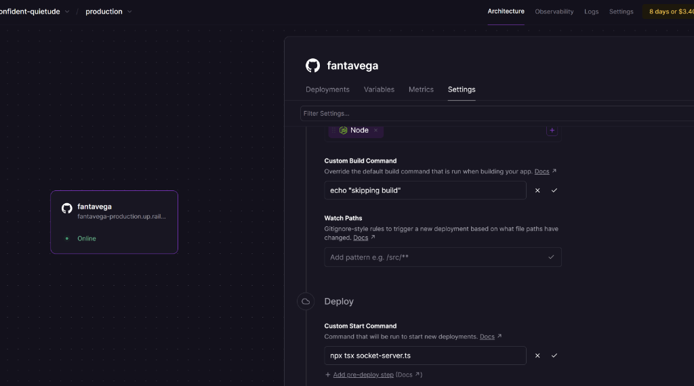

# Guida Migrazione Railway (Solo Socket Server)

Questa guida spiega come creare un nuovo progetto Railway da zero per ospitare **ESCLUSIVAMENTE il Socket Server**, collegandolo al Frontend esistente su Vercel e all'Autenticazione Clerk.

**Scenario**:
*   **Vercel**: Ospita il Frontend (Invariato).
*   **Clerk**: Gestisce l'Auth (Invariato).
*   **Railway**: Nuovo account per ospitare il Socket Server (Nuovo Deployment).
*   **Turso**: Database condiviso (Invariato).

---

## 1. Creazione Progetto su Railway

1.  Vai su [Railway.app](https://railway.app/) e accedi con il tuo **nuovo account**.
2.  Clicca su **"New Project"** -> **"Deploy from GitHub repo"**.
3.  Seleziona il repository `fantavega`.
4.  Clicca su **"Deploy Now"**.

> **Nota**: Railway proverà inizialmente a deployare tutto come sito Next.js. Non preoccuparti, lo riconfigureremo nel prossimo passo per far girare solo il Socket Server.

---

## 2. Configurazione Servizio Socket

Dobbiamo dire a Railway di avviare il file `socket-server.ts` invece del sito web.

1.  Clicca sul servizio appena creato (il riquadro del repository).
    
2.  Vai su **Settings**.
3.  Scorri fino a **Service Commands**.
4.  Configura esattamente come nello screenshot qui sotto:

    

    *   **Custom Build Command**: `echo "skipping build"`
        *   (Questo velocizza il deploy ignorando la build del frontend, dato che qui serve solo il socket).
    *   **Custom Start Command**: `npx tsx socket-server.ts`
        *   (Questo avvia il server socket).

5.  Clicca su **Deploy** (o aspetta che Railway lo faccia in automatico).

---

## 3. Variabili d'Ambiente (Railway)

Ora configuriamo le variabili *solo* per questo servizio Socket. Vai nel tab **Variables** e aggiungi:

| Nome Variabile | Valore | Note |
| :--- | :--- | :--- |
| `PORT` | `3001` | La porta interna del container. |
| `TURSO_DATABASE_URL` | `libsql://fantavega50...` | Copia dal vecchio progetto o `.env.raylway`. |
| `TURSO_AUTH_TOKEN` | `...` | Copia dal vecchio progetto o `.env.raylway`. |
| `ALLOWED_ORIGINS` | `https://fantavega.vercel.app` | **IMPORTANTE**: Inserisci qui il dominio Vercel del tuo frontend. Se ne hai più di uno (es. anteprima), separali con una virgola. Esempio: `https://fantavega.vercel.app,https://fantavega-git-main...` |

> **Nota su Clerk**: Il Socket Server *riceve* i token ma non gestisce il flusso di login, quindi NON servono le chiavi `NEXT_PUBLIC_CLERK_...` su Railway. Servono solo su Vercel.

---

## 4. Generazione Dominio Pubblico

1.  Vai nel tab **Networking** del servizio su Railway.
2.  Sotto "Public Networking", clicca **Generate Domain**.
3.  Ti verrà assegnato un dominio casuale (es. `socket-production-1234.up.railway.app`).
4.  **COPIA questo dominio**. Ti servirà tra un attimo.

---

## 5. Aggiornamento Frontend (Su Vercel)

Ora dobbiamo dire al frontend su Vercel di connettersi a *questo* nuovo server Railway invece che a quello vecchio.

1.  Vai nella Dashboard del tuo progetto su **Vercel**.
2.  Vai su **Settings** -> **Environment Variables**.
3.  Modifica (o crea) la variabile `NEXT_PUBLIC_SOCKET_URL`.
4.  Incolla il dominio copiato da Railway, aggiungendo `https://` davanti.
    *   Esempio: `https://socket-production-1234.up.railway.app`
5.  **IMPORTANTE**: Vai su **Deployments** e fai un **Redeploy** dell'ultima versione (o fai un nuovo push) affinché la modifica delle variabili abbia effetto.

---

## 6. Configurazione Clerk (Opzionale/Verifica)

Poiché il frontend rimane su Vercel, il dominio che l'utente visita (`fantavega.vercel.app`) non è cambiato.
*   **NON devi modificare nulla su Clerk**. Gli "Allowed Origins" su Clerk devono puntare a Vercel, e quelli sono già corretti.

---

## Riassunto Operativo

Se hai fatto tutto correttamente:
1.  **Railway**: Sta eseguendo `npx tsx socket-server.ts` con le credenziali DB e accetta connessioni da Vercel (`ALLOWED_ORIGINS`).
2.  **Vercel**: Il frontend sa che deve connettersi al nuovo indirizzo Railway (`NEXT_PUBLIC_SOCKET_URL`).

**Test**: Apri `fantavega.vercel.app`, apri la console (F12) e verifica che non ci siano errori di connessione WebSocket (codice 1006 o "connection refused").
